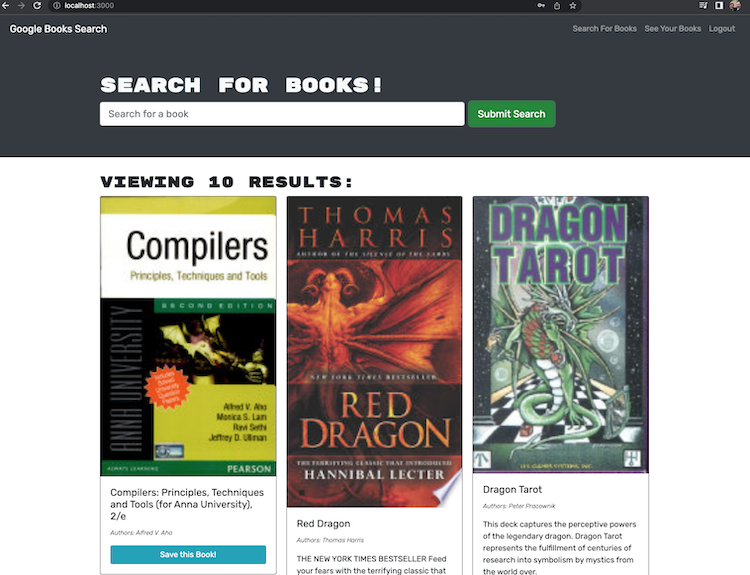
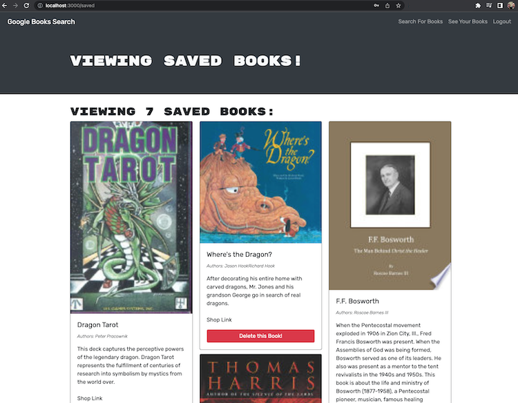
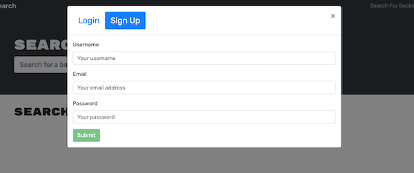

 
 

# Google Books Search - GraphQL Conversion from REST

## Description

Google Books Search is a REACT application that interfaces with [Google Book API](https://developers.google.com/books) to deliver search results that a user can save in their account.  This web app uses MongoDB, ExpressJS on the backend server.  It was converted from a REST interface to now use Apollo GraphQL interface.  The front end client also uses the GraphQL query interface instead of REST routes.   Users saved search results now link to the google book store for users to purchase their books. 

## Table of Contents

- [Demo and Screen Shots](#demo)
- [Installation](#installation)
- [Usage](#usage)
- [Credits](#credits)
- [License](#license)
- [Questions](#questions)

## Demo
***

Demo:

[Demo Link](https://arcane-everglades-73888.herokuapp.com/)

Screen Shots:

## Installation
***

Clone repository. Inside main directory, run 'npm install concurrently'. Then run 'npm install'.  

## Usage
***

In parent directory, run 'npm run build', then either 'npm run develop' for development environment, or 'npm start' for production.  App will be live on http://localhost:3000

## Credits
 ***

[conradjohnson](https://github.com/conradjohnson)

 ## License
 ***

  ISC License

  [https://opensource.org/licenses/ISC](https://opensource.org/licenses/ISC)
  
  Permission to use, copy, modify, and/or distribute this software for any
  purpose with or without fee is hereby granted, provided that the above
  copyright notice and this permission notice appear in all copies.
  
  THE SOFTWARE IS PROVIDED "AS IS" AND THE AUTHOR DISCLAIMS ALL WARRANTIES WITH
  REGARD TO THIS SOFTWARE INCLUDING ALL IMPLIED WARRANTIES OF MERCHANTABILITY
  AND FITNESS. IN NO EVENT SHALL THE AUTHOR BE LIABLE FOR ANY SPECIAL, DIRECT,
  INDIRECT, OR CONSEQUENTIAL DAMAGES OR ANY DAMAGES WHATSOEVER RESULTING FROM
  LOSS OF USE, DATA OR PROFITS, WHETHER IN AN ACTION OF CONTRACT, NEGLIGENCE OR
  OTHER TORTIOUS ACTION, ARISING OUT OF OR IN CONNECTION WITH THE USE OR
  PERFORMANCE OF THIS SOFTWARE.
  
  Copyright (c) 2022 James Johnson
          

# Questions
***
For questions or assistance, please contact through [GitHub Account](https://github.com/conradjohnson) or email: [notmyemail@gmal.com](mailto:notmyemail@gmal.com)

 [Back to top](#description)